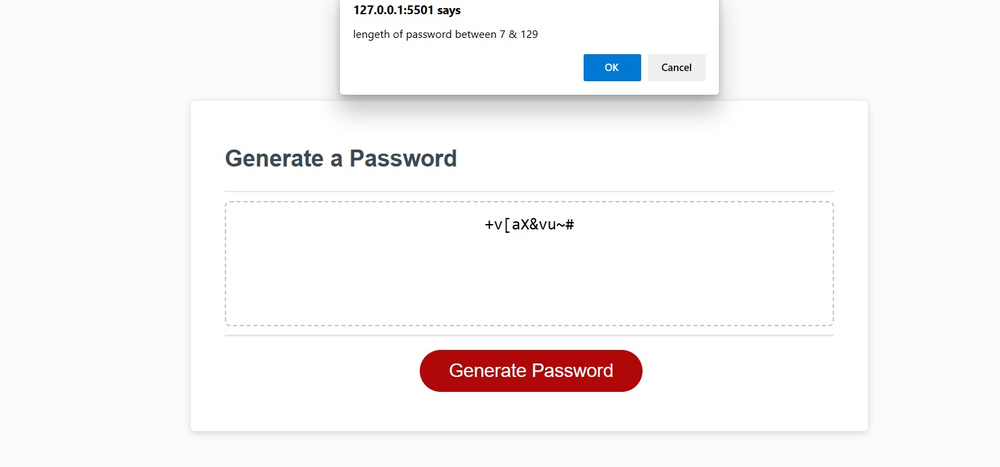

# password
// Bisrat Mengesha

// Module -3 assignment

Genetaring pass word assignment 

script.js is written by using different functions

using array to define list of password parameter

using if function to check lists

using for loop to assign password to the password holder array

 git branch https://github.com/Hellobisrat/password

clone link https://hellobisrat.github.io/password/

